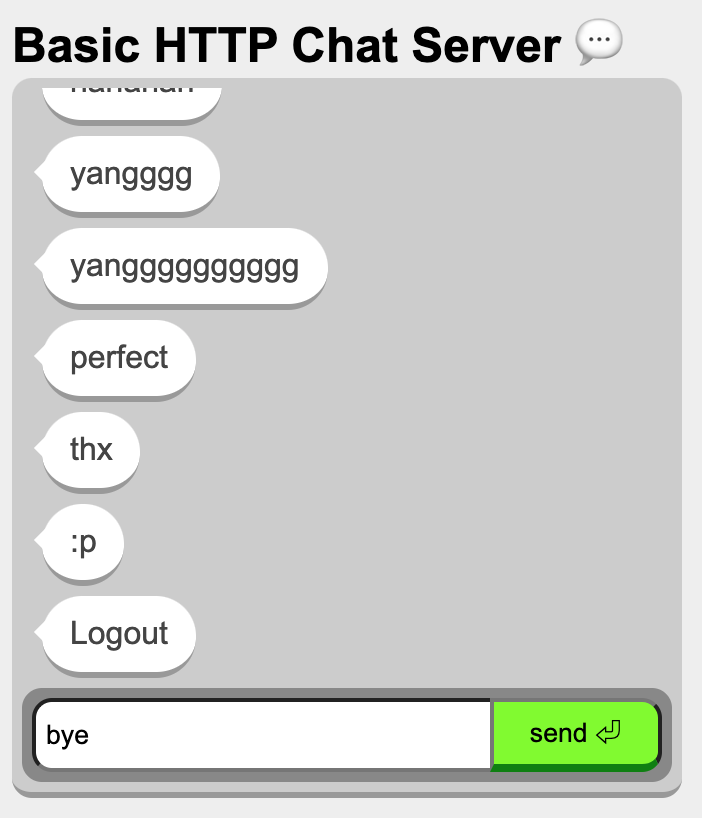

# chat server experiment with different protocols
- HTTP (1st experiment) implemented 
- MQTT (2nd experiment)
- web socket (3rd experiment)

## aws connect and pull repo from github using SSH
https://medium.com/pacroy/connecting-to-github-with-ssh-f54248ccf30d
